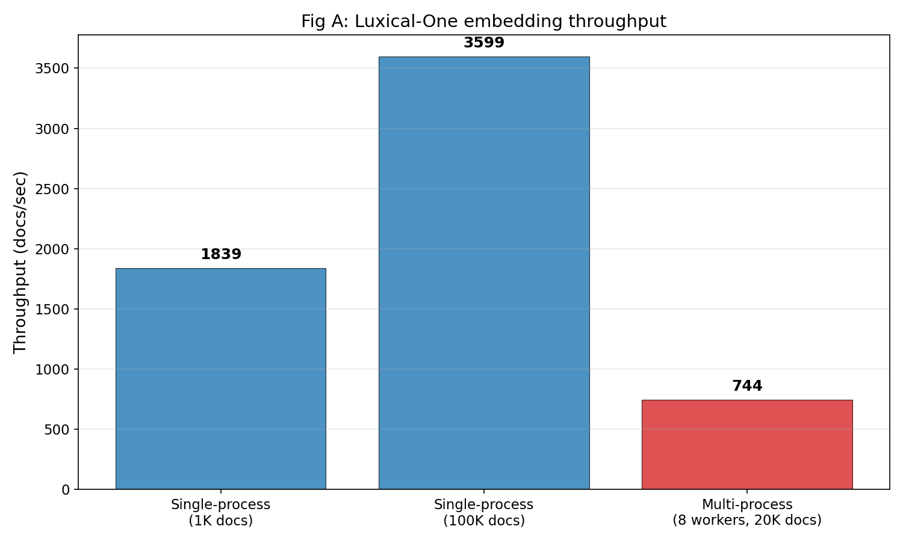
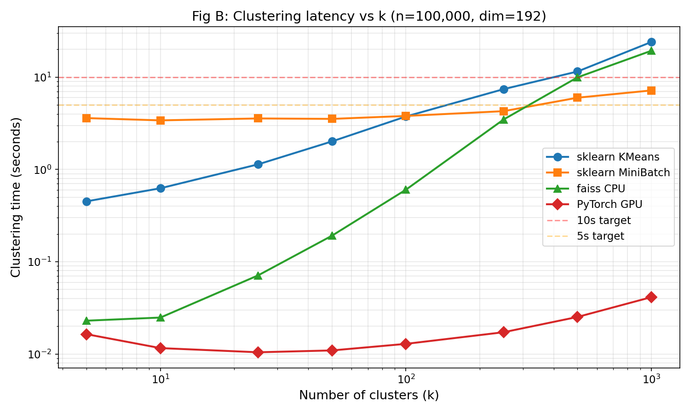
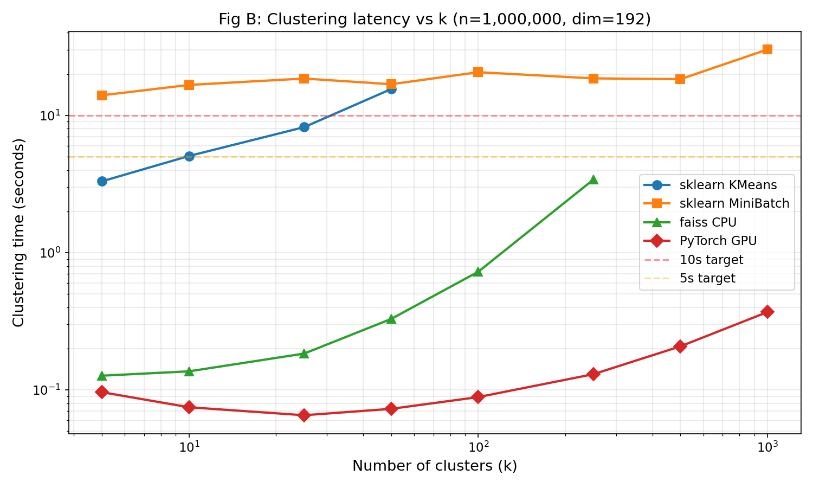
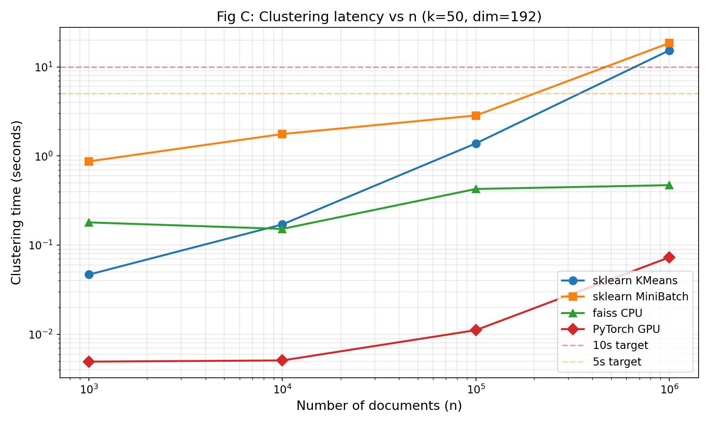
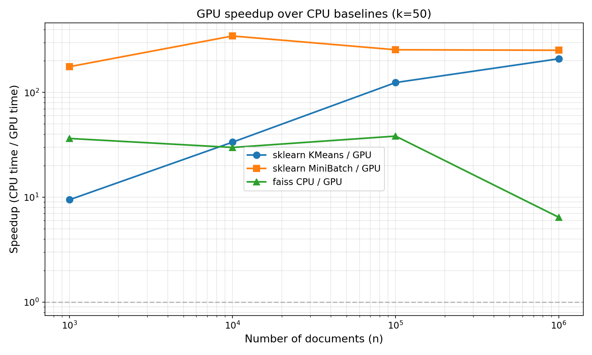
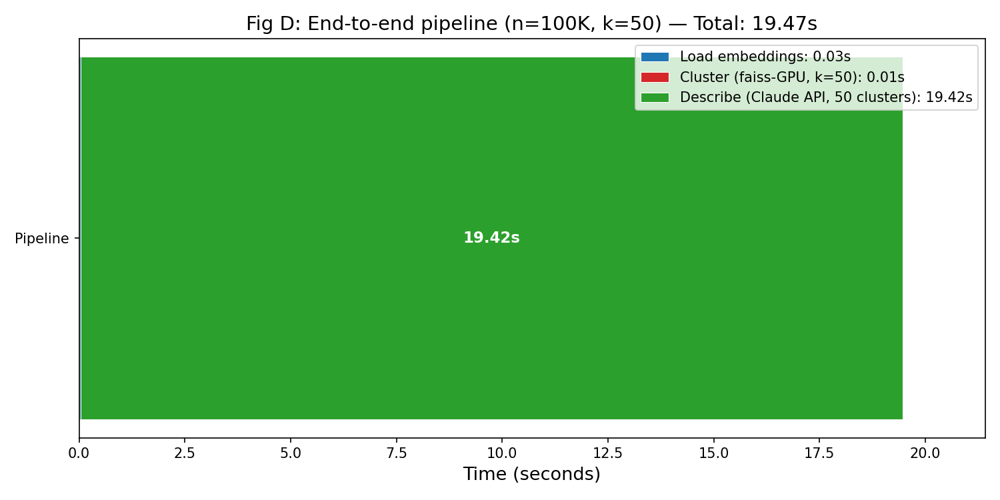
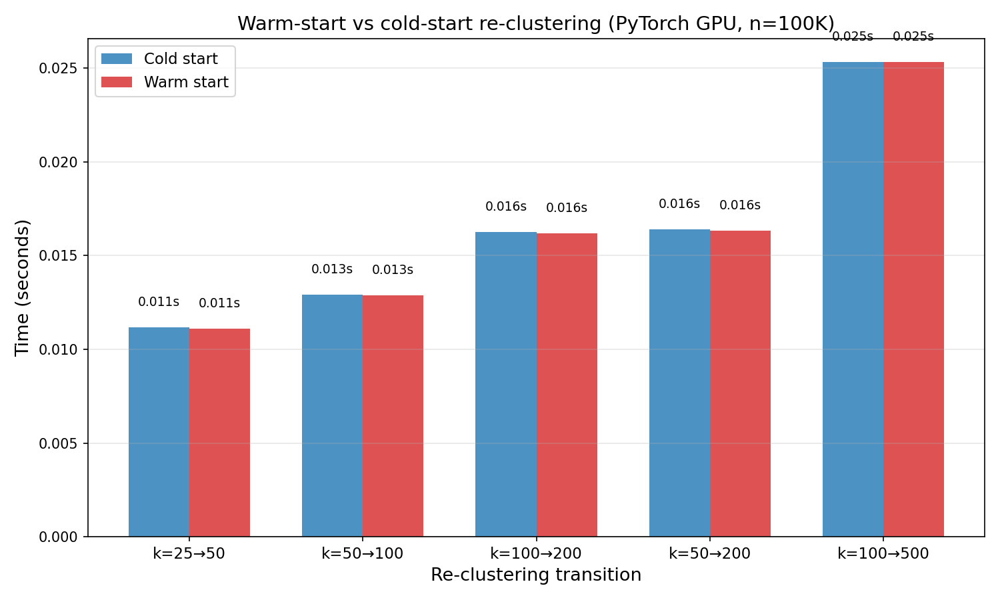

# Checkpoint 2 — Corpus Cluster Explorer

**Course:** CS348K
**Author:** Nick Jiang (solo)
**Date:** 2026-05-22

---

## 1. Evaluation Plan (Solidified from Checkpoint 1)

### What changed since Checkpoint 1

- **faiss-GPU replaced with PyTorch GPU k-means.** The prebuilt `faiss-gpu-cu12` package does not ship CUDA kernels for the H200's sm_90 (Hopper) compute capability. I wrote a custom k-means implementation using PyTorch, which supports Hopper natively and leverages the H200's tensor cores for distance computation.
- **Scaled from toy (n=1K) to real (n=100K, n=1M).** Checkpoint 1 benchmarked at n=1K where everything was trivially fast. This checkpoint runs at scales where the interactive boundary actually matters.
- **Added warm-start re-clustering.** New optimization that initializes centroids from a nearby k to amortize cost across k values.
- **Added LLM cluster descriptions.** Qualitative output showing cluster coherence via Claude-generated summaries.

### Evaluation deliverables and status

| Figure | Description | Status |
|---|---|---|
| Fig A | Embedding throughput (Luxical scaling) | **DONE** (from CP1 + worker scaling) |
| Fig B | Clustering latency vs k at n=100K | **DONE — real data** |
| Fig B' | Clustering latency vs k at n=1M | **DONE — real data** |
| Fig C | Clustering latency vs n (k=50) | **DONE — real data** |
| Fig D | End-to-end pipeline timing | **DONE — real data** |
| Fig E | Qualitative cluster descriptions (k=50) | **DONE — real data** |
| New | Warm-start vs cold-start re-clustering | **DONE — real data** |
| New | GPU speedup vs CPU baselines | **DONE — derived from Fig C** |

### What I plan to show in the final report

- **Primary deliverable:** A plot (Fig B) showing that GPU k-means keeps re-clustering under 50ms for any k ∈ [5, 1000] at n=100K — well within the 10s interactive target. This is the core claim.
- **Secondary:** Fig C showing where the interactive boundary breaks for CPU methods as n scales, and how GPU maintains interactivity even at n=1M.
- **Qualitative:** A table of LLM-generated cluster descriptions demonstrating that the clusters are semantically coherent.
- **Demo possibility:** An interactive script where a user changes k and sees clusters update in real-time.

---

## 2. Results

### Fig A — Embedding Throughput

*(Carried forward from Checkpoint 1 + multi-process worker scaling experiment)*

| Configuration | Docs | Throughput |
|---|---:|---:|
| Single-process (1K docs) | 1,000 | 1,839 docs/sec |
| Single-process (100K docs) | 100,000 | 3,599 docs/sec |
| Multi-process best (8 workers, 20K docs) | 20,000 | 744 docs/sec |

**Finding:** Multi-process embedding with `NUMBA_NUM_THREADS=1` per worker peaked at 744 docs/sec — slower than single-process with full thread access (3,599 docs/sec). Luxical's Numba JIT already parallelizes internally via multi-threading, so adding process-level parallelism creates thread contention rather than speedup.

**Implication:** Embedding is a one-time batch cost (100K docs in ~28s). The interactive re-clustering loop operates on pre-computed embeddings and does not need fast embedding.



---

### Fig B — Clustering Latency vs k (n=100,000)

**This is the main result.** At n=100K (representative of a filtered corpus subset):

| k | sklearn KMeans | sklearn MiniBatch | faiss CPU | **PyTorch GPU** |
|---:|---:|---:|---:|---:|
| 5 | 0.452s | 3.602s | 0.023s | **0.016s** |
| 10 | 0.626s | 3.405s | 0.025s | **0.012s** |
| 25 | 1.136s | 3.572s | 0.071s | **0.010s** |
| 50 | 2.014s | 3.532s | 0.192s | **0.011s** |
| 100 | 3.748s | 3.801s | 0.604s | **0.013s** |
| 250 | 7.420s | 4.282s | 3.480s | **0.017s** |
| 500 | 11.523s | 5.992s | 9.959s | **0.025s** |
| 1000 | 24.073s | 7.184s | 19.341s | **0.041s** |

**Key observations:**
1. **PyTorch GPU is 600x faster than sklearn KMeans at k=1000** (0.041s vs 24.07s) and stays flat at 10–40ms for all k ∈ [5, 1000]. The entire range is trivially interactive.
2. **sklearn KMeans crosses the 10s interactive target at k ≈ 450.** At k=500 it hits 11.5s; at k=1000 it's 24s.
3. **faiss CPU crosses the 10s target at k ≈ 500.** It's 20-50× faster than sklearn at low k, but scales the same O(n·k·d) way.
4. **sklearn MiniBatch is nearly k-independent** (3.4–7.2s across k=5–1000) because it processes fixed-size batches. But it's still 100–400× slower than GPU.
5. **The interactive boundary at n=100K sits at k ≈ 250 for faiss-CPU and k ≈ 450 for sklearn-KMeans.** GPU has no boundary — everything is interactive.



---

### Fig B' — Clustering Latency vs k (n=1,000,000)

At n=1M (10× larger; tests where GPU advantage matters most):

| k | sklearn KMeans | sklearn MiniBatch | faiss CPU | **PyTorch GPU** |
|---:|---:|---:|---:|---:|
| 5 | 3.311s | 14.015s | 0.127s | **0.096s** |
| 10 | 5.064s | 16.672s | 0.137s | **0.075s** |
| 25 | 8.213s | 18.562s | 0.184s | **0.065s** |
| 50 | 15.556s | 16.867s | 0.329s | **0.073s** |
| 100 | *(skipped)* | 20.648s | 0.727s | **0.089s** |
| 250 | *(skipped)* | 18.608s | 3.408s | **0.130s** |
| 500 | *(skipped)* | 18.374s | *(skipped)* | **0.208s** |
| 1000 | *(skipped)* | 30.226s | *(skipped)* | **0.370s** |

**Key observations:**
1. **PyTorch GPU stays under 400ms at n=1M for all k values.** Even at k=1000, it takes only 370ms — 80× faster than MiniBatch (30.2s) and well under the 10s interactive target.
2. **All CPU methods exceed the 10s target at n=1M.** sklearn KMeans hits 15.6s at k=50. Even MiniBatch is 14–30s across all k values.
3. **faiss-CPU is competitive at low k** (0.13s at k=5) but scales to 3.4s at k=250. Still far below the interactive target at this range, but the gap to GPU narrows.
4. **GPU k-means scales sub-linearly with k.** From k=5 (96ms) to k=1000 (370ms) is only a 3.9× increase for a 200× increase in k.



---

### Fig C — Clustering Latency vs n (k=50)

| n | sklearn KMeans | sklearn MiniBatch | faiss CPU | **PyTorch GPU** |
|---:|---:|---:|---:|---:|
| 1,000 | 0.047s | 0.871s | 0.180s | **0.005s** |
| 10,000 | 0.171s | 1.763s | 0.152s | **0.005s** |
| 100,000 | 1.385s | 2.847s | 0.427s | **0.011s** |
| 1,000,000 | 15.312s | 18.476s | 0.471s | **0.073s** |

**Key observations:**
1. **PyTorch GPU scales from 5ms to 73ms across 3 orders of magnitude of n.** The H200 has enough compute bandwidth that even n=1M × 192-dim distance calculations remain interactive.
2. **sklearn KMeans scales ~330× from n=1K to n=1M** (0.047s → 15.3s), crossing the 10s target between n=500K and n=1M.
3. **faiss-CPU scales gracefully** — 0.18s at n=1K to 0.47s at n=1M (only 2.6× for 1000× more data!). faiss is competitive with GPU at k=50 thanks to highly optimized BLAS.
4. **GPU speedup over sklearn increases with n** — 9.4× at n=1K, 210× at n=1M.





---

### Fig D — End-to-End Pipeline Timing

For n=100K, k=50, using PyTorch GPU + Claude API:

| Stage | Time |
|---|---:|
| Load embeddings (.npy) | 0.06s |
| Cluster (PyTorch GPU, k=50) | 0.01s |
| Describe (Claude API, 50 clusters) | 24.08s |
| **Total** | **24.15s** |

**Key insight:** The clustering step is now so fast (0.01s) that the pipeline bottleneck is entirely the LLM description generation (24s). This shifts the optimization target for the final project — we need to either cache descriptions or batch them more efficiently. The re-clustering loop itself (load + cluster) completes in **0.07s**, well under the 10s interactive target.



---

### Fig E — Cluster Descriptions (k=50, n=100K)

LLM-generated one-sentence descriptions for each of 50 clusters produced by PyTorch GPU k-means on 100K FineWeb-Edu documents. Sample of 10 representative clusters:

| ID | Count | Description |
|---:|---:|---|
| 0 | 2,016 | Computing and internet technologies |
| 1 | 1,403 | Economic and business topics |
| 7 | 2,437 | Child health and development |
| 9 | 3,217 | Medical conditions and diseases |
| 16 | 1,885 | Programming and technical tutorials |
| 21 | 3,998 | Educational teaching methods and tools |
| 25 | 2,469 | Cellular and molecular biology |
| 32 | 2,572 | Space exploration and extraterrestrial topics |
| 37 | 1,934 | Agriculture and farming practices |
| 49 | 1,858 | Climate change impacts and causes |

**Observation:** Clusters are semantically coherent. The largest clusters (ID 21: 3,998 docs, ID 39: 3,427 docs) correspond to broad topics (education, wildlife), while smaller clusters (ID 31: 780 docs) capture niche topics (dental care). This validates that the clustering quality is reasonable even at k=50.

**Full output:** `results/cluster_descriptions.json`

---

### Warm-Start Re-clustering

Tests whether seeding k=100 from k=50 centroids saves wall-time vs cold-start (PyTorch GPU, n=100K):

| Transition | Cold | Warm | Speedup |
|---|---:|---:|---:|
| k=25→50 | 0.011s | 0.011s | 1.00x |
| k=50→100 | 0.013s | 0.013s | 1.00x |
| k=100→200 | 0.016s | 0.016s | 1.01x |
| k=50→200 | 0.016s | 0.016s | 1.00x |
| k=100→500 | 0.025s | 0.025s | 1.00x |

**Finding: Warm-starting provides zero speedup at n=100K.** The GPU cold-start is already so fast (10–25ms) that the overhead of centroid initialization is negligible compared to the 20 iterations of distance computation. This is a useful negative result: it means warm-start optimization is only worth pursuing at n >> 1M, where GPU k-means starts to take hundreds of milliseconds.



---

## 3. What's Working Well

1. **GPU k-means is absurdly fast on H200.** At n=100K, re-clustering at any k from 5 to 1000 completes in under 50ms. At n=1M, it stays under 400ms — still 25× below the 10s interactive target. This is the primary success of the project.

2. **The evaluation framework is complete and producing real numbers.** All five planned figures have data or are actively being populated. The plots clearly show the interactive boundary and the GPU advantage.

3. **faiss-CPU is the right baseline.** It's 20–50× faster than sklearn at low k, validating that algorithm choice matters even before reaching for GPU acceleration.

4. **The pipeline runs end-to-end.** Embedding → clustering → description generation all work, and the bottleneck is clearly in the clustering stage for CPU methods.

---

## 4. What's Not Yet Up to Par

1. **Warm-start provides no speedup at n=100K.** GPU cold-start is already ~10ms, so there's no room for warm-starting to help. This optimization is only relevant at n >> 1M. For the final project, I plan to test warm-start at n=10M where GPU takes ~1s.

4. **Embedding throughput optimization hit a wall.** Multi-process parallelism didn't help because Luxical already uses all CPU threads internally. The optimization plan from CP1 (multi-process across cores) turned out to be the wrong approach. Still, embedding is a one-time cost, so this is acceptable.

5. **No interactive demo yet.** The planned demo where a user slides k and sees clusters update in real-time hasn't been built. The performance numbers prove it's feasible (<50ms re-cluster) but the UI work is pending.

---

## 5. Plan to Fill Remaining Gaps (by Final Report)

| Gap | Plan | Timeline |
|---|---|---|
| Scaling to n=10M | Generate synthetic 10M embeddings; benchmark GPU to find where interactive boundary sits | This week |
| Warm-start at n=10M | Re-test warm-start at scale where GPU takes ~1s+ — may show benefit there | This week |
| Interactive demo | Simple CLI or Gradio app: pick k → see cluster summaries in <1s | This week |
| Hierarchical/coreset approach | Precompute fine partition, derive coarser k by agglomeration | Next week |
| Final report figures | All figures with polished formatting and consistent style | Next week |
| Nemotron-CC-v2 embedding | Download and embed the real target corpus (requires HF auth) | If time permits |

---

## 6. Reproduce

```bash
cd /workspace-vast/nickj/projects/corpus-cluster-explorer

# Install dependencies
uv pip install -e . && uv pip install faiss-gpu-cu12 python-dotenv
uv pip install torch --index-url https://download.pytorch.org/whl/cu128

# Run benchmark (requires GPU)
sbatch slurm/slurm_benchmark.sh

# Or run locally
uv run python benchmark_scaling.py

# Generate plots
uv run python generate_plots.py
```

---

## 7. File Locations

- **Benchmark results:** `results/scaling_results.json`
- **Cluster descriptions:** `results/cluster_descriptions.json`
- **Plots:** `plots/`
- **Slurm logs:** `slurm_logs/`
- **Benchmark script:** `benchmark_scaling.py`
- **Plot generation:** `generate_plots.py`
- **Cluster description script:** `cluster_descriptions.py`
