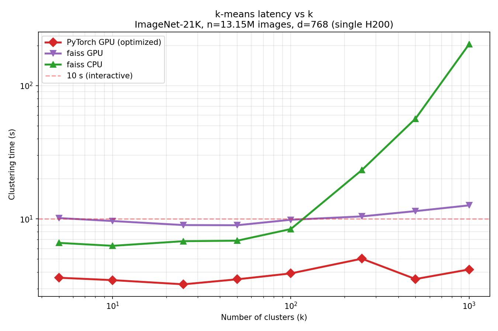
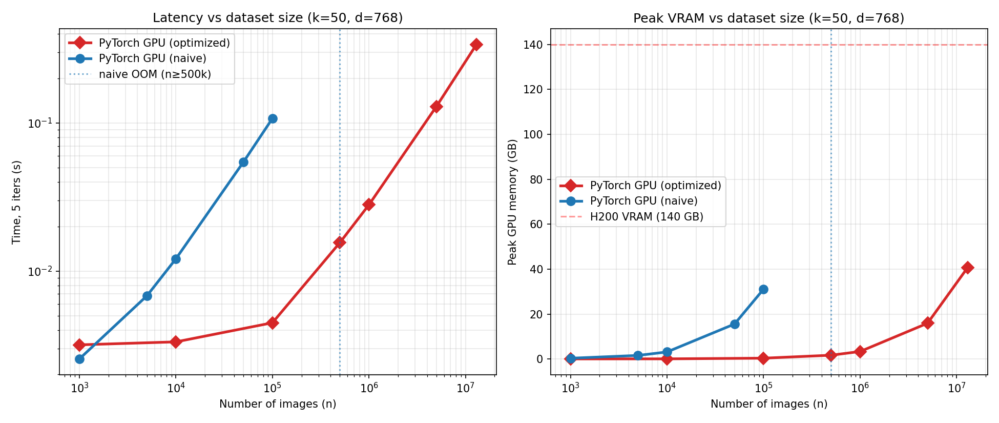

# Scaling Clustering Algorithms to Pretraining Corpora

*interactive clustering of 13M images on a single GPU, with automatic SAE-feature cluster naming*

Nick Jiang, nj0@stanford.edu

## Background and Setup

Exploratory analysis of a large image collection is iterative: cluster the data, inspect the groups,
adjust the granularity, and cluster again, alternating between a coarse view (`k=5`) and fine
sub-populations (`k=1000`). At 13 million images each pass must be fast enough to keep the loop
interactive, and the resulting clusters must be interpretable without manually inspecting hundreds of
images per cluster.

The input is 13,153,442 ImageNet-21K images, each encoded as a 768-dimensional DINOv2 CLS embedding,
together a 40 GB `float32` matrix. For a chosen `k`, the system returns the cluster assignments, the
cluster sizes, and a short text label per cluster. The performance target is to re-cluster the entire
corpus for any `k` in [5, 1000] in under ten seconds on a single H200, with no multi-node execution at
query time, and to label each cluster without decoding images on every request.

This yields a falsifiable hypothesis: a GPU k-means expressed through a matrix-multiply distance
formulation can cluster the full corpus in under ten seconds for every `k` up to 1000 and outperform
faiss, and SAE features can label the resulting clusters without loading their images. The hypothesis
fails if clustering remains in the tens of seconds or requires approximating the distances.

The technical crux is a single step of k-means. Each iteration assigns every point to its nearest
centroid, which requires the distance matrix `D ∈ ℝ^{n×k}`. Computing `‖x−c‖²` by broadcasting
`(n,1,d) − (1,k,d) → (n,k,d)` produces, at `n=13.15M`, `k=1000`, `d=768`, a roughly 40 TB intermediate
that cannot be allocated on any GPU. The project reduces to making this step both feasible and fast on
one device.

## Approach

The system has three stages: embedding, clustering, and naming. Embedding
(`scripts/embed_imagenet21k.py`) streams ImageNet-21K parquet shards from HuggingFace, decodes JPEGs on
a 32-thread pool (PIL releases the GIL), runs DINOv2 ViT-B/14 in fp16, and writes fp32 CLS embeddings
shard by shard with a resumable checkpoint. Throughput is about 327 images/sec on one H200 (~11 hours
for the corpus); the shards merge into a single 40 GB array that is loaded to the GPU once and held
resident.

Clustering avoids the `(n,k,d)` intermediate by expanding the squared distance:

```
‖x − c‖² = ‖x‖² − 2 x·cᵀ + ‖c‖²
```

`‖x‖²` is constant across centroids for a given point and does not affect the `argmin`, so it is
omitted. Each iteration computes `−2 x·cᵀ + ‖c‖²` in a single `torch.addmm`, producing the `(n,k)`
distance block directly, then takes the `argmin` over `k`. Rows are processed in chunks of about one
million: at `k=1000` a one-million-row chunk is 4 GB, so the working set is bounded by the chunk size
rather than by `n`. The centroid update is one `scatter_add_` followed by a count normalization. This
is `algorithms/torch_optimized.py`, the implementation used by the dashboard.

The optimized formulation outperforms the naive broadcast for two reasons. First, the naive
distance is entirely elementwise (subtract, square, sum) and contains no matrix multiplication, so it
cannot use the GPU's GEMM kernels, which are the most heavily optimized path on the hardware and run on
the tensor cores. Instead it executes a bandwidth-limited elementwise pass that leaves most of the
device idle. The expansion recasts the dominant term as a GEMM (`−2 x·cᵀ`), placing the same computation on
those kernels. Second, the naive version materializes the full `(n,k,d)` difference tensor (`k×` the
data size) and streams it through HBM, making it memory-bound and ultimately out-of-memory at scale,
whereas the matmul form never holds `(n,k,d)` and chunking caps the `(n,k)` block at a few GB.

The design was reached by comparing baselines. The naive broadcast (`algorithms/torch_naive.py`) is
more than 20× slower where it fits and runs out of memory near `n=500k` at `k=50`. faiss-CPU is
competitive at small `k` but degrades sharply as `k` grows, and faiss-GPU was slower than the PyTorch
implementation at this problem shape. An fp16 distance variant was tested for large `k`; it is faster
but was not adopted, since fp32 with chunking already satisfies the memory and accuracy requirements.
(The recorded `k≥500` points used that fp16 variant, which accounts for the slight dip in the latency
curve.)

Naming uses a TopK sparse autoencoder trained on the DINOv2 CLS embeddings (`scripts/train_sae.py`,
`sae.py`), following the "Scaling and evaluating sparse autoencoders" recipe (pre-bias subtraction,
exact top-k activation, unit-norm tied decoder, AuxK dead-feature revival), with `d_sae=12288` (16×
expansion) and `k=64`. Each of the ~12,288 features is labeled once, offline: a multimodal LLM is shown
a montage of the feature's top-activating images and returns a short concept
(`scripts/label_features.py`), validated by a held-out detection test. At query time, a cluster is
labeled by encoding its ~20 nearest images' embeddings through the SAE, retaining features that fire in
at least 3 of 20 images, and prompting a small LLM for a distinguishing label.

Routing the label through SAE features is a performance decision. The direct alternative, sending each
cluster's representative images to a multimodal LLM, is dominated by image I/O, because the images are
not local and must be fetched and decoded from HuggingFace before the model runs. The feature-based
path uses only the embeddings already resident on the GPU, so labeling requires no image I/O and the
LLM reads only a short list of feature names; images are loaded lazily, and only for a cluster the user
opens for inspection. This applies the "interpretable embeddings" method of Jiang et al. (2025) to a
vision backbone.

## Evaluation and Results

Success is defined as re-clustering all 13.15M images for any `k` in [5, 1000] in under ten seconds on
one H200, faster than faiss, without degrading cluster quality, and producing a usable label per
cluster.

All timings are measured on one NVIDIA H200 (140 GB) over the 13,153,442 DINOv2 CLS embeddings
(768-d fp32, 40 GB) held resident on the GPU. The baselines are the broadcast GPU k-means
(`torch-naive`), faiss-GPU, faiss-CPU (faiss 1.14.2), and sklearn MiniBatch, all exposing the same
`kmeans(data, k, niter)` interface in `algorithms/`. Each measurement is the median of 3 repeats of a
20-iteration fit, with peak VRAM recorded. Results are stored in `results/benchmarks/` and the figures
are regenerated by `scripts/make_plots.py`. Correctness is verified in `scripts/test_algorithms.py`: on
synthetic data the optimized and naive methods produce identical assignments (agreement 1.000),
confirming the expansion is exact rather than approximate.

**Latency versus `k` at full scale.**



Clustering time is flat at 3–5 seconds across the full range of `k`, clearing the ten-second target
everywhere, and is 2–3× faster than faiss-GPU and up to ~50× faster than faiss-CPU. The flat profile
follows from the per-iteration cost being dominated by the assignment GEMM (`O(n·k·d)`): at small `k`
the tensor cores are underutilized, so latency is set by fixed per-iteration overhead and only rises
past `k≈100`. faiss-CPU shows the opposite trend, growing super-linearly to 205 s at `k=1000` as the
same `O(n·k·d)` work runs with poor cache behavior on CPU. faiss-GPU being slower than the PyTorch
implementation comes down to data residency: faiss's GPU k-means copies the embeddings between CPU and
GPU on each reassignment step rather than keeping them on the device, so it repeatedly pays the
host-to-device transfer of the full 40 GB, whereas my implementation transfers the data once at load
and keeps it resident for every iteration.

**Scaling with dataset size** (fixed `k=50`, `d=768`).



The optimized method scales linearly in `n`, reaching the full corpus in 0.34 s for five iterations
(100k→13M is about 130× the data for roughly 85× the time, slightly sub-linear as larger multiplies use
the tensor cores more efficiently). The naive method exhibits both failure modes on this plot: where it
fits it is already more than 20× slower, attributable to the absence of any matrix multiplication and
hence no tensor-core use; and its peak memory, dominated by the `(n,k,d)` difference tensor, exhausts
the GPU near `n=500k`, so it never reaches the millions.

**Cluster labels.** The labels depend on the SAE, evaluated separately (full results in the archived
SAE writeup). The CLS SAE reconstructs accurately (FVU 0.18, no dead features), and its auto-generated
feature labels achieve mean detection balanced-accuracy 0.88 (median 0.90; 90% of features above 0.7)
against a shuffled-label control of 0.50 (chance). The control collapsing to chance while real labels
score far above it indicates the labels carry verifiable visual meaning. Representative cluster labels
include "citrus fruit cross-sections," "daisy flowers with yellow centers," "headwear and hats," and
"carnivorous pitcher plants," produced without decoding the clusters' images.

## Team Responsibilities

Solo project; all work by Nick Jiang.

## References

1. S. Lloyd. *Least squares quantization in PCM.* IEEE Trans. Information Theory, 28(2):129–137, 1982.
   (k-means / Lloyd's algorithm.)
2. D. Arthur and S. Vassilvitskii. *k-means++: The advantages of careful seeding.* SODA 2007.
3. J. Johnson, M. Douze, H. Jégou. *Billion-scale similarity search with GPUs.* IEEE Trans. Big Data,
   2019. (faiss.)
4. M. Oquab et al. *DINOv2: Learning Robust Visual Features without Supervision.* TMLR 2024.
   (DINOv2 ViT-B/14 backbone.)
5. L. Gao et al. *Scaling and evaluating sparse autoencoders.* 2024. (TopK SAE recipe, AuxK.)
6. Jiang et al. *Interpretable Embeddings with Sparse Autoencoders: A Data Analysis Toolkit.* 2025.
   <https://interp-embed.com>. Labels SAE feature dimensions from activated versus non-activated
   examples and uses them to cluster and diff data, adapted here to name image clusters.
